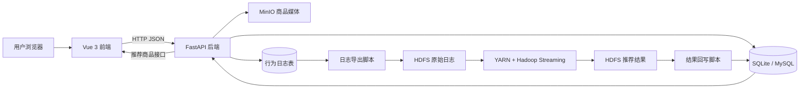
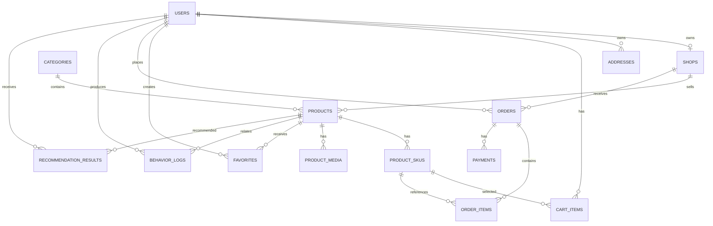
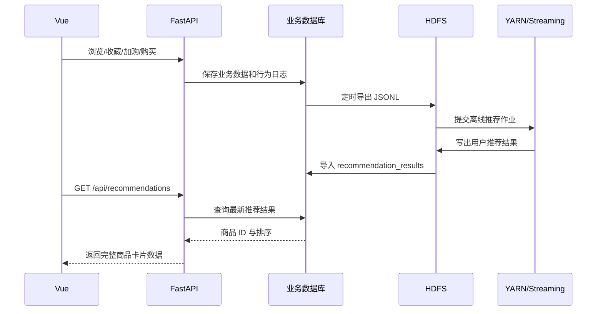

# Bacon Mall 后端、数据库与大数据实施方案

## 1. 项目目标

Bacon Mall 最终要形成一条完整、可演示的数据链路：

1. 用户在 Vue 商城中浏览、收藏、加购和购买商品。
2. FastAPI 处理业务请求，并把业务数据写入 SQLite（后期可切换 MySQL）。
3. FastAPI 同时记录用户行为日志。
4. 定时任务把行为日志导出为 JSON Lines 文件并上传到 HDFS。
5. Hadoop Streaming 使用 Python Mapper/Reducer 计算用户偏好和商品热度。
6. 计算结果写回业务数据库的推荐结果表。
7. FastAPI 返回推荐商品，Vue 首页按普通商品流展示。

这个项目不是要复刻完整京东，而是要把“真实可用的电商闭环”和“可证明的大数据离线推荐闭环”做好。

## 2. 当前状态

目前已有的后端 MVP：

- FastAPI 可以启动，Swagger 文档可以访问。
- 已有用户注册、登录、商品列表、商品详情接口。
- 已有行为日志写入接口。
- 已有一个根据行为分类排序的临时推荐接口。
- SQLite 已有 `users`、`sessions`、`products`、`product_skus`、`behavior_logs` 5 张表。

目前主要不足：

- 路由、数据库操作和业务逻辑集中在少数文件中，继续增加订单等功能会难以维护。
- 还没有店铺、购物车、收藏、地址、订单、支付和正式推荐结果表。
- 前端大量功能仍使用 `localStorage` 和 mock 数据。
- 前端约 104 件商品与后端 6 件商品的 ID 和数据不一致。
- 行为日志还没有导出到 HDFS，也没有真正运行推荐作业。
- 后端目录尚未纳入 Git 仓库。

## 3. 总体架构



开发阶段建议的职责分配：

| 运行位置 | 负责内容 |
| --- | --- |
| macOS | Vue、FastAPI、SQLite/MySQL、MinIO、开发脚本 |
| master | NameNode、SecondaryNameNode、ResourceManager、提交 Hadoop 作业 |
| slave1/slave2 | DataNode、NodeManager、执行 Mapper/Reducer |

Hadoop 集群只负责大数据存储和批量计算，不负责直接响应商城页面请求。

## 4. 推荐的项目仓库结构

最终建议把前端、后端、大数据脚本放入同一个项目仓库：

```text
bacon-ecommerce-platform/
├── frontend/                     # 现有 Vue 项目
├── backend/
│   ├── app/
│   │   ├── main.py               # 创建 FastAPI 应用、注册路由
│   │   ├── core/
│   │   │   ├── config.py         # 环境变量和配置
│   │   │   └── security.py       # 密码与登录令牌
│   │   ├── db/
│   │   │   ├── database.py       # 数据库连接和会话
│   │   │   └── models.py         # SQLAlchemy 数据表模型
│   │   ├── schemas/              # 请求体和响应体定义
│   │   │   ├── user.py
│   │   │   ├── product.py
│   │   │   ├── cart.py
│   │   │   ├── order.py
│   │   │   └── behavior.py
│   │   ├── routers/              # API 地址
│   │   │   ├── auth.py
│   │   │   ├── products.py
│   │   │   ├── carts.py
│   │   │   ├── favorites.py
│   │   │   ├── orders.py
│   │   │   ├── sellers.py
│   │   │   ├── behaviors.py
│   │   │   └── recommendations.py
│   │   ├── services/             # 业务规则
│   │   │   ├── auth_service.py
│   │   │   ├── product_service.py
│   │   │   ├── order_service.py
│   │   │   ├── media_service.py
│   │   │   └── recommendation_service.py
│   │   └── repositories/         # 集中编写数据库查询
│   ├── scripts/
│   │   ├── seed_products.py      # 导入演示商品
│   │   └── export_behaviors.py   # 导出行为日志
│   ├── tests/
│   ├── uploads/                   # 不使用 MinIO 时的临时开发目录
│   ├── .env.example
│   ├── requirements.txt
│   └── README.md
├── bigdata/
│   ├── streaming/
│   │   ├── preference_mapper.py
│   │   ├── preference_reducer.py
│   │   ├── popularity_mapper.py
│   │   ├── popularity_reducer.py
│   │   └── generate_recommendations.py
│   ├── scripts/
│   │   ├── upload_to_hdfs.sh
│   │   ├── run_recommendation_job.sh
│   │   └── import_results.py
│   ├── sample_data/
│   └── README.md
├── docs/
│   ├── database.md
│   ├── api.md
│   └── hadoop-demo.md
└── README.md
```

说明：这是最终结构，不需要第一天一次性创建所有空文件。每实现一个模块时再创建对应文件。

## 5. 后端技术选择

| 需求 | 选择 | 原因 |
| --- | --- | --- |
| Web API | FastAPI | 已经使用，自动生成 Swagger，适合学习 |
| 数据校验 | Pydantic | FastAPI 原生配合，防止错误数据进入业务逻辑 |
| 数据库操作 | SQLAlchemy 2.x | 同一套代码可从 SQLite 切换到 MySQL |
| 数据库迁移 | Alembic | 表结构变化时保留历史，避免删除数据库重建 |
| 身份认证 | 随机 Session Token | 比 JWT 更直观，并与当前 `sessions` 表兼容 |
| 密码保存 | PBKDF2 哈希 | 当前已有实现，不保存明文密码 |
| 商品媒体 | MinIO | 适合图片和视频等对象文件，数据库只保存对象路径 |
| 离线计算 | Hadoop Streaming + Python | 可以继续使用 Python，不必先学习 Java MapReduce |
| 自动测试 | pytest + FastAPI TestClient | 验证接口和权限，减少前后端联调时排错成本 |

第一阶段继续使用 SQLite。业务流程稳定后，只修改数据库连接地址并处理少量字段差异，即可切换 MySQL。

## 6. 后端模块和 API 设计

统一使用 `/api` 前缀。返回格式保持：

```json
{
  "code": "0000",
  "info": "success",
  "data": {}
}
```

### 6.1 用户与身份认证

| 方法 | 地址 | 用途 | 权限 |
| --- | --- | --- | --- |
| POST | `/api/auth/register` | 用户或商家注册 | 公开 |
| POST | `/api/auth/login` | 登录并获取 token | 公开 |
| POST | `/api/auth/logout` | 注销当前 token | 已登录 |
| GET | `/api/users/me` | 获取当前用户资料 | 已登录 |
| PUT | `/api/users/me` | 修改个人资料 | 已登录 |
| GET/POST/PUT/DELETE | `/api/addresses` | 管理收货地址 | 买家 |

### 6.2 商品、分类与店铺

| 方法 | 地址 | 用途 | 权限 |
| --- | --- | --- | --- |
| GET | `/api/categories` | 分类树 | 公开 |
| GET | `/api/products` | 分页、搜索、分类、排序 | 公开 |
| GET | `/api/products/{id}` | 商品详情和 SKU | 公开 |
| GET | `/api/shops/{id}` | 店铺主页 | 公开 |
| POST | `/api/seller/products` | 商家新增商品 | 商家 |
| PUT | `/api/seller/products/{id}` | 商家修改自己的商品 | 商家 |
| PATCH | `/api/seller/products/{id}/status` | 上架或下架 | 商家 |
| POST | `/api/media/upload` | 上传商品图片或视频 | 商家 |

商品列表必须支持 `page`、`pageSize`、`keyword`、`categoryId`、`sort` 参数，不能一次返回全部 100 多件商品。

### 6.3 购物车与收藏

| 方法 | 地址 | 用途 | 权限 |
| --- | --- | --- | --- |
| GET | `/api/cart` | 查询购物车 | 买家 |
| POST | `/api/cart/items` | 添加 SKU | 买家 |
| PUT | `/api/cart/items/{id}` | 修改数量 | 买家 |
| DELETE | `/api/cart/items/{id}` | 删除商品 | 买家 |
| GET | `/api/favorites` | 收藏列表 | 买家 |
| POST | `/api/favorites/{productId}` | 收藏商品 | 买家 |
| DELETE | `/api/favorites/{productId}` | 取消收藏 | 买家 |

### 6.4 订单与支付

| 方法 | 地址 | 用途 | 权限 |
| --- | --- | --- | --- |
| POST | `/api/orders` | 从购物车创建订单 | 买家 |
| GET | `/api/orders` | 买家订单列表 | 买家 |
| GET | `/api/orders/{id}` | 订单详情 | 买家/所属商家 |
| POST | `/api/orders/{id}/cancel` | 取消未支付订单 | 买家 |
| POST | `/api/orders/{id}/pay` | 模拟支付 | 买家 |
| POST | `/api/seller/orders/{id}/ship` | 商家发货 | 商家 |
| POST | `/api/orders/{id}/receive` | 买家确认收货 | 买家 |

实习项目不需要接入真实支付宝或微信。模拟支付成功并正确修改订单状态即可。

### 6.5 行为日志与推荐

| 方法 | 地址 | 用途 | 权限 |
| --- | --- | --- | --- |
| POST | `/api/behaviors` | 记录浏览、收藏、加购等行为 | 登录用户优先 |
| GET | `/api/recommendations` | 获取当前用户推荐商品 | 登录用户/游客 |
| GET | `/api/history` | 查询浏览足迹 | 买家 |
| DELETE | `/api/history` | 清空浏览足迹 | 买家 |

前端只负责报告行为。推荐权重和排序逻辑必须放在后端或 Hadoop 中，不能让前端决定推荐结果。

## 7. 数据库设计原则

- 主键（PK）：每一行数据的唯一编号，例如 `product_id`。
- 外键（FK）：表示表之间的关系，例如商品的 `seller_id` 指向商家用户。
- 金额：使用整数“分”保存，例如 188 元保存为 `18800`，避免小数计算误差。
- 时间：统一保存 UTC 时间，返回前端时再显示为本地时间。
- 删除：订单等重要业务数据不直接物理删除，使用状态字段。
- SQLite 必须开启外键约束；切换 MySQL 后使用 InnoDB。
- 经常查询的字段建立索引，行为日志尤其需要 `user_id + created_at` 索引。

## 8. 核心数据库表

### 8.1 用户与店铺

#### `users`

| 字段 | 含义 |
| --- | --- |
| `user_id` PK | 用户 ID |
| `username` | 昵称 |
| `email` UNIQUE | 登录邮箱 |
| `phone` | 手机号 |
| `password_hash` | 密码哈希 |
| `role` | `buyer` 或 `seller` |
| `status` | `active`、`disabled` |
| `created_at`、`updated_at` | 创建和修改时间 |

#### `shops`

| 字段 | 含义 |
| --- | --- |
| `shop_id` PK | 店铺 ID |
| `owner_user_id` FK UNIQUE | 店主用户 |
| `name` | 店铺名称 |
| `description` | 店铺简介 |
| `logo_object_key` | MinIO Logo 路径 |
| `status` | `pending`、`active`、`closed` |

店铺信息从 `users` 表中拆出，因为“用户身份”和“店铺资料”是两类数据。

#### `sessions`

保存登录 token、用户 ID、创建时间和过期时间。注销时删除或失效该 token。

### 8.2 商品

#### `categories`

保存分类 ID、名称、父分类 ID、排序值和状态，支持二级分类。

#### `products`

| 字段 | 含义 |
| --- | --- |
| `product_id` PK | 商品 ID |
| `shop_id` FK | 所属店铺 |
| `category_id` FK | 商品分类 |
| `name` | 商品名称 |
| `description` | 商品说明 |
| `min_price_cents` | 最低 SKU 价格 |
| `total_stock` | SKU 库存合计 |
| `sales_count` | 已售数量，用于热度展示 |
| `status` | `draft`、`active`、`inactive` |
| `created_at`、`updated_at` | 时间 |

#### `product_skus`

保存 SKU ID、商品 ID、规格名称、属性 JSON、价格、库存和 SKU 编码。商品的库存和成交必须具体落到 SKU。

#### `product_media`

保存商品 ID、SKU ID（可空）、媒体类型 `image/video`、MinIO 对象路径、排序值。不要把图片二进制内容写进数据库。

### 8.3 买家交易

#### `addresses`

保存用户收货人、电话、省市区、详细地址、是否默认地址。

#### `cart_items`

保存用户 ID、SKU ID、数量、选中状态。对 `(user_id, sku_id)` 设置唯一约束，防止同一 SKU 重复多行。

#### `favorites`

保存用户 ID、商品 ID和收藏时间。对 `(user_id, product_id)` 设置唯一约束。

#### `orders`

保存订单号、买家、店铺、订单状态、商品总额、优惠金额、实付金额、收货地址快照和时间。

订单状态建议只允许以下流转：

```text
pending_payment -> paid -> shipped -> completed
pending_payment -> cancelled
paid -> refund_pending -> refunded
```

#### `order_items`

保存订单 ID、商品 ID、SKU ID、下单时的商品名称、规格、单价、数量和图片路径。这里保存“快照”，避免商家以后修改商品导致历史订单变化。

#### `payments`

保存支付流水号、订单 ID、支付方式、支付金额、状态和支付时间。当前只实现模拟支付。

### 8.4 用户体验扩展表

| 表 | 用途 | 实现阶段 |
| --- | --- | --- |
| `coupons` | 优惠券模板 | 第二轮 |
| `user_coupons` | 用户领取和使用记录 | 第二轮 |
| `reviews` | 订单完成后的商品评价 | 第二轮 |
| `product_questions` | 商品问答 | 第二轮 |
| `feedback` | 帮助与反馈 | 第二轮 |

### 8.5 推荐相关表

#### `behavior_logs`

| 字段 | 含义 |
| --- | --- |
| `event_id` PK | 全局唯一事件 ID |
| `user_id` | 登录用户；游客可为空 |
| `session_id` | 一次访问会话 |
| `product_id` | 相关商品 |
| `category_id` | 冗余分类，方便 Hadoop 计算 |
| `action` | `view/favorite/cart/purchase/search` 等 |
| `quantity` | 数量，可空 |
| `order_id` | 购买行为对应订单，可空 |
| `source` | 首页、搜索、详情页等来源 |
| `created_at` | 行为发生时间 |
| `exported_at` | 导出到 HDFS 的时间，可空 |

#### `recommendation_results`

| 字段 | 含义 |
| --- | --- |
| `user_id` | 用户 ID |
| `product_id` | 推荐商品 |
| `score` | 推荐得分 |
| `reason_code` | `category_preference`、`popular` 等内部原因 |
| `rank_no` | 该用户的排序位置 |
| `batch_date` | 哪一批 Hadoop 任务生成 |
| `created_at` | 写入时间 |

对 `(user_id, product_id, batch_date)` 设置唯一约束；推荐接口读取最新 `batch_date` 的前 N 条。

## 9. 核心表关系



## 10. MinIO 媒体存储方案

MinIO 适合这个项目，但用途要与 HDFS 分开：

- MinIO：存商品主图、详情图、视频、店铺 Logo。
- HDFS：存行为日志、MapReduce 中间结果和推荐结果文件。
- 数据库：存 MinIO 的 `object_key`、媒体类型、排序等元数据。

建议对象路径：

```text
product-media/
  shops/{shop_id}/products/{product_id}/images/{uuid}.webp
  shops/{shop_id}/products/{product_id}/videos/{uuid}.mp4
  shops/{shop_id}/logo/{uuid}.webp
```

上传流程：商家选择文件 -> FastAPI 校验类型和大小 -> FastAPI 上传 MinIO -> 数据库保存对象路径 -> 前端通过后端返回的 URL 显示。

第一轮可先用外部图片或 `backend/uploads` 跑通商品 CRUD；商品接口稳定后再接 MinIO。不要把 MinIO 和 Hadoop 同时作为第一周任务。

## 11. 行为日志规范

HDFS 输入使用 JSON Lines：一行一个 JSON，便于追加和 Streaming 解析。

```json
{"eventId":"01J...","userId":1,"sessionId":"s-123","productId":1001,"categoryId":10,"action":"cart","quantity":1,"source":"product_detail","createdAt":"2026-07-10T09:30:00+08:00"}
```

第一版行为权重：

| 行为 | 权重 |
| --- | ---: |
| 浏览 `view` | 1 |
| 搜索后点击 `search_click` | 2 |
| 收藏 `favorite` | 3 |
| 加购 `cart` | 5 |
| 购买 `purchase` | 10 |
| 取消收藏 `unfavorite` | -2 |
| 退款 `refund` | -8 |

同一个用户短时间重复刷新同一商品不能无限增加得分。导出或计算时按“用户 + 商品 + 行为 + 时间窗口”去重。

## 12. HDFS 目录设计

```text
/bacon-mall/
├── raw/
│   ├── behavior/dt=2026-07-10/part-00000.jsonl
│   └── products/dt=2026-07-10/products.jsonl
├── warehouse/
│   ├── user_category_scores/dt=2026-07-10/
│   └── product_popularity/dt=2026-07-10/
├── output/
│   └── recommendations/dt=2026-07-10/
└── archive/
```

`dt=日期` 是分区。以后计算某一天或某一段时间时，不必扫描全部历史文件。

## 13. Hadoop Streaming 离线推荐方案

### 作业 1：计算用户分类偏好

Mapper 读取行为日志，输出：

```text
user_id|category_id    action_weight
```

Reducer 对相同用户和分类求和，输出用户最偏好的分类及分数。

### 作业 2：计算商品热度

Mapper 按商品输出行为权重，Reducer 汇总得到每件商品的热度。购买和加购比浏览更重要。

### 作业 3：生成候选推荐

将“用户分类偏好”与“同分类热门商品”组合：

```text
recommend_score = category_preference_score * 0.7 + product_popularity_score * 0.3
```

然后执行以下过滤：

- 过滤已下架商品。
- 过滤库存为 0 的 SKU。
- 可选：过滤用户最近已购买的商品。
- 每个用户保留前 20～50 件商品。

### 冷启动策略

新用户没有行为时，按全站热度、新品和类目均衡返回商品。游客可以依据当前会话最近浏览的分类临时排序。

### 结果回写

Hadoop 输出建议使用 TSV：

```text
user_id    product_id    score    rank_no    batch_date
```

`import_results.py` 从 master 下载或读取结果，批量写入 `recommendation_results`。FastAPI 不直接在请求过程中调用 Hadoop，因为离线任务可能运行几分钟。

## 14. 推荐数据完整流程



## 15. 分阶段完成计划

以零基础学习速度估算，完整项目约 25～35 个学习日。每阶段完成后再进入下一阶段。

| 阶段 | 预计时间 | 工作内容 | 完成标准 |
| --- | ---: | --- | --- |
| 0. 项目整理 | 1 天 | 备份、统一 Git 仓库、环境变量、README | 前端、后端可分别启动，代码均被 Git 管理 |
| 1. 后端模块化 | 2 天 | 拆分 `main`、路由、Schema、数据库层；加入 SQLAlchemy | `/docs` 正常，原有接口测试通过 |
| 2. 用户与店铺 | 2～3 天 | 注册登录、注销、当前用户、角色权限、店铺资料 | 买家不能访问商家接口，商家不能操作别人的商品 |
| 3. 商品与媒体 | 3～4 天 | 分类、商品分页、SKU CRUD、100+ 商品导入、MinIO | 前端商品列表全部来自后端，图片可稳定显示 |
| 4. 购物车和收藏 | 2～3 天 | 购物车、收藏、浏览足迹、行为记录 | 刷新或换浏览器后数据仍存在数据库中 |
| 5. 订单闭环 | 3～4 天 | 地址、结算、下单、模拟支付、发货、收货、取消 | 买家和商家看到同一订单状态变化 |
| 6. 商家中心 | 2～3 天 | 商品管理、订单处理、销量与库存概览 | 商家只能管理自己的店铺数据 |
| 7. 前后端全面联调 | 2～3 天 | Axios 统一配置、token、错误提示、移除业务 mock | 关闭后端时前端明确报错，不再悄悄使用 mock |
| 8. 日志进入 HDFS | 2 天 | 导出 JSONL、上传脚本、HDFS 分区 | HDFS 页面能看到按日期存储的真实行为日志 |
| 9. Streaming 推荐 | 3～4 天 | 偏好、热度、候选推荐作业 | YARN 有成功任务，HDFS 有推荐结果文件 |
| 10. 推荐结果回写 | 2 天 | 导入结果表、推荐 API、冷启动 | 不同用户首页商品顺序不同，结果可解释 |
| 11. 测试和答辩材料 | 2～3 天 | API 测试、流程截图、数据字典、演示脚本 | 可连续演示电商闭环和 Hadoop 推荐闭环 |

## 16. 项目范围控制

必须完成：

- 买家和商家两类账号及权限。
- 商品、SKU、购物车、收藏、订单和模拟支付。
- 至少 100 件可查询商品，列表使用分页。
- 浏览、收藏、加购、购买行为全部记录。
- 行为日志成功上传 HDFS。
- 至少一个完整 Hadoop Streaming 推荐流程在 YARN 上运行成功。
- 推荐结果写回数据库并由首页使用。

第二轮再做：

- 优惠券、评价、问答、反馈后台。
- 更复杂的时间衰减、相似商品或协同过滤算法。
- MySQL 切换和 MinIO 完整权限配置。

不在本项目核心范围：

- 真实在线支付。
- 真实物流平台接口。
- 即时聊天客服。
- Kafka、Spark、Flink 等额外大数据组件。
- MinIO 分布式集群和高可用部署。

## 17. 下一步执行顺序

接下来不要立即写 Hadoop。正确顺序是：

1. 先把当前后端纳入 Git，并确定单仓库目录。
2. 再把现有单文件 FastAPI 拆成模块，但保持现有接口可用。
3. 建立正式数据库模型和迁移。
4. 先完成用户、店铺和商品 API。
5. 把前端商品数据真正接到后端。
6. 完成交易闭环后，再把已经产生的真实行为日志送入 Hadoop。

这样做的原因是：Hadoop 推荐必须有可靠、统一的用户 ID、商品 ID、分类 ID 和行为数据作为输入。
