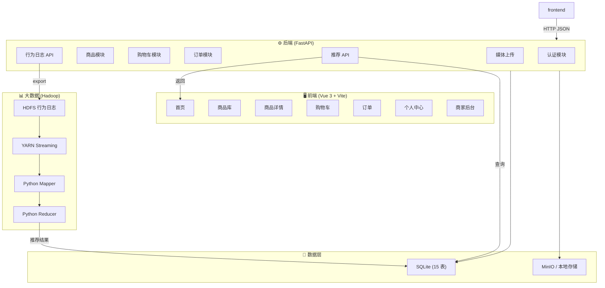
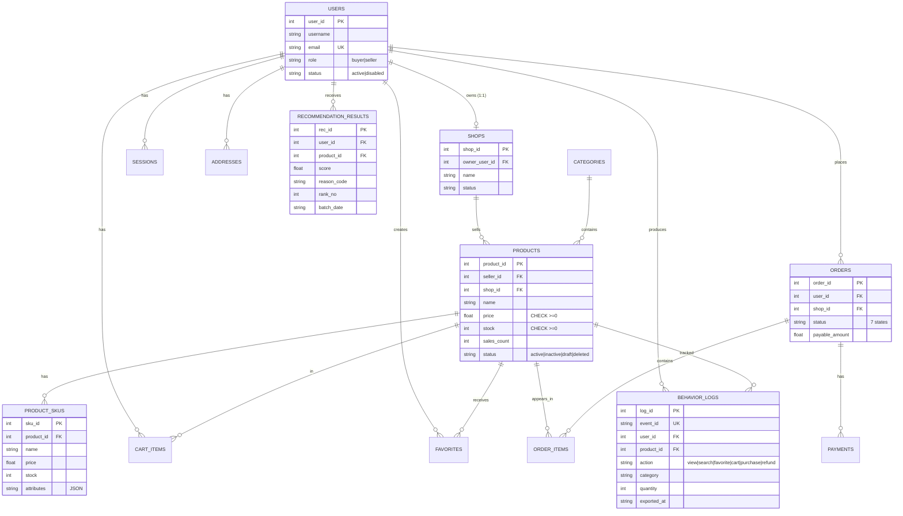
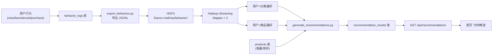

# Bacon Mall 系统架构

## 系统架构图



## 数据库 ER 图



## 推荐流程



### 推荐公式

```
score = category_preference × 0.5 + product_preference × 0.3 + popularity × 0.2
```

### 行为权重

| 行为 | 权重 | 含义 |
|------|------|------|
| view | 1 | 浏览 |
| search | 2 | 搜索 |
| favorite | 3 | 收藏 |
| cart | 4 | 加购 |
| purchase | 5 | 购买 |

## 技术栈

| 层 | 技术 | 说明 |
|----|------|------|
| 前端框架 | Vue 3 + Vite 6 + TypeScript | SPA |
| 状态管理 | Pinia | 组件状态 |
| HTTP 客户端 | Axios + 拦截器 | 自动 Token |
| 后端框架 | FastAPI | Python Web API |
| 数据库 | SQLite 3 | 15 张表 |
| ORM | 原生 sqlite3 | 轻量无依赖 |
| 对象存储 | MinIO / 本地 FS | 双模 |
| 认证 | Session Token + PBKDF2 | 密码哈希 |
| 大数据计算 | Hadoop 3.x + YARN | Streaming |
| 计算语言 | Python 3 | Mapper/Reducer |
| 数据格式 | JSON Lines | 行为日志 |
