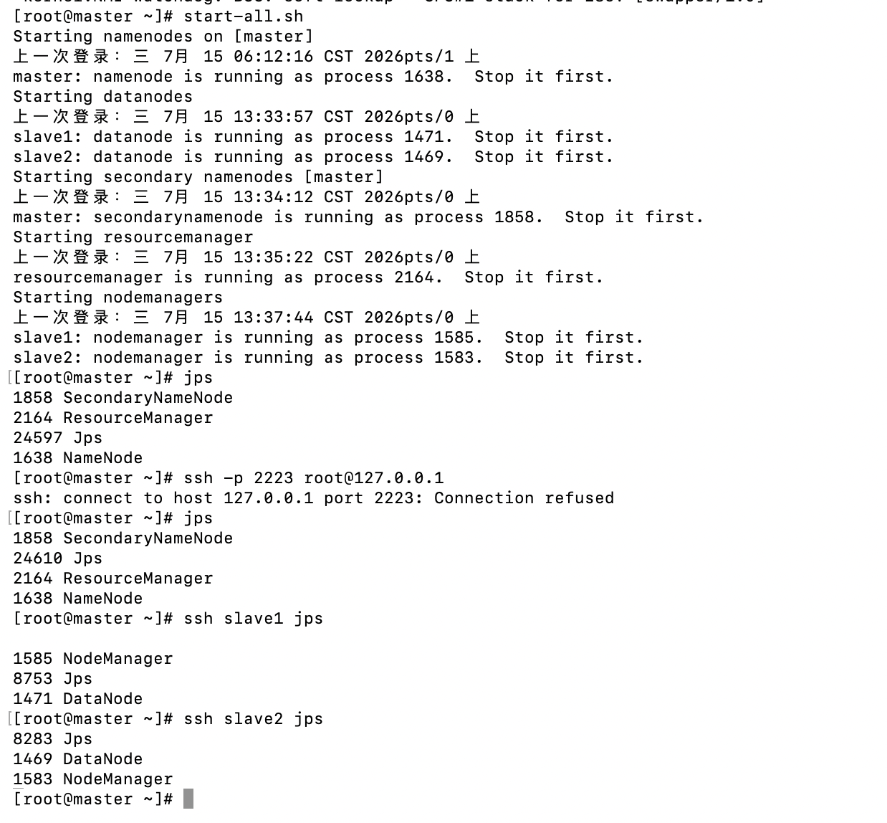
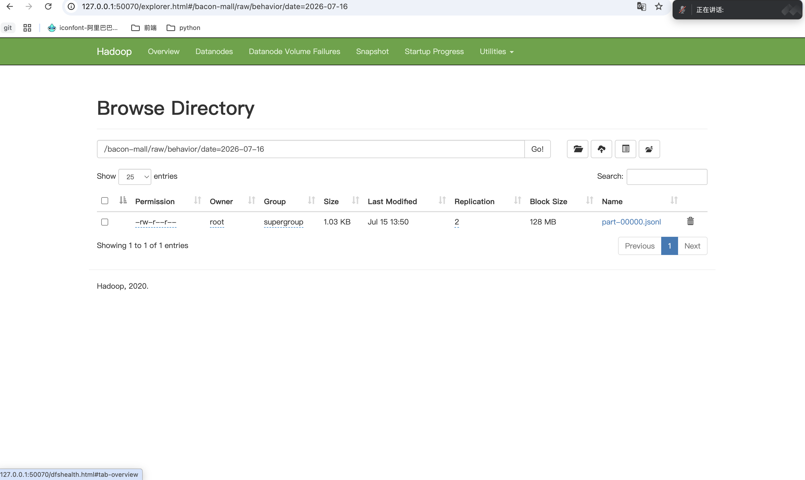
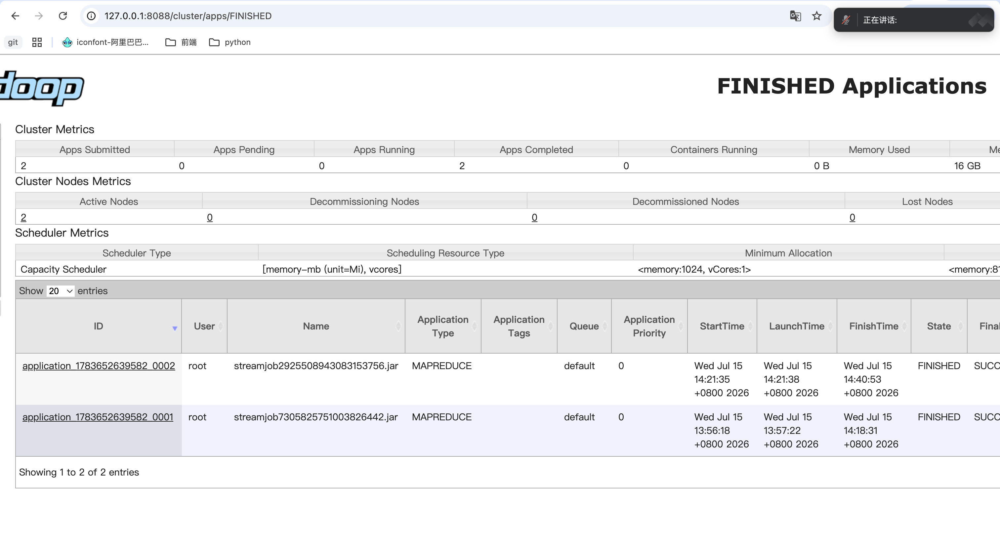
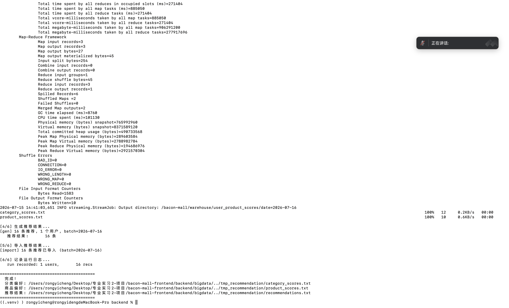

# Bacon Mall 演示脚本

## 演示目标

展示完整链路：买家行为写入业务数据库，Hadoop Streaming 在 HDFS/YARN 上离线计算，推荐结果回写 SQLite，首页正常展示推荐商品。

## 1. 启动服务

```bash
# 终端 1：MinIO（如尚未启动）
cd backend
./scripts/start_minio.sh

# 终端 2：FastAPI
cd backend
source .venv/bin/activate
uvicorn app.main:app --reload --host 127.0.0.1 --port 8001

# 终端 3：Vue
npm run dev -- --host 127.0.0.1
```

前端地址以 Vite 终端输出为准；后端 Swagger 为 `http://127.0.0.1:8001/docs`。

演示账号：

| 身份 | 账号 | 密码 |
| --- | --- | --- |
| 买家 | `student@example.com` | `123456` |
| 商家 | `seller@example.com` | `123456` |

## 2. 买家电商流程

1. 用买家账号登录，首页展示“为你精选”。
2. 进入商品页，演示搜索、一级分类和二级分类筛选。
3. 打开一个数码商品详情，完成浏览、收藏和加购。
4. 在购物车选择商品，进入结算页，确认收货地址并提交订单。
5. 在支付页完成模拟支付。
6. 打开个人中心，展示真实行为记录、兴趣分类、订单和收货地址。

## 3. 商家流程

1. 退出并用商家账号登录。
2. 进入商家后台，展示商品数量、订单数量和营收看板。
3. 打开待发货订单并执行发货。
4. 切回买家账号，在订单列表确认收货。

## 4. Hadoop 离线推荐

先启动三台虚拟机，在 `master` 中执行：

```bash
start-all.sh
jps
```

再从 Mac 的 `backend/` 目录运行：

```bash
source .venv/bin/activate
bash bigdata/scripts/run_pipeline.sh hadoop-remote
```

该命令依次完成：

1. 导出 SQLite 中未导出的行为日志 JSONL。
2. 通过 SSH 上传日志与 Python Mapper/Reducer 到 `master`。
3. 上传 JSONL 到 HDFS。
4. 在 YARN 上运行分类偏好、商品偏好两个 Hadoop Streaming 作业。
5. 下载 HDFS 计算结果到 Mac。
6. 生成推荐结果并导入 SQLite 的 `recommendation_results` 表。

2026-07-16 已实际验收：

- `application_1783652639582_0001`：用户分类偏好，`SUCCEEDED`。
- `application_1783652639582_0002`：用户商品偏好，`SUCCEEDED`。
- 两个作业各执行 `2` 个 Map、`1` 个 Reduce。
- 导入 `16` 条推荐结果，覆盖 `1` 位用户。

## 5. 证据页面

Mac 建立端口转发：

```bash
ssh -fN -p 2222 -L 50070:master:50070 -L 8088:master:8088 root@127.0.0.1
```

- HDFS：`http://127.0.0.1:50070/`
  - `/bacon-mall/raw/behavior/date=2026-07-16`
  - `/bacon-mall/warehouse/user_category_scores/date=2026-07-16`
  - `/bacon-mall/warehouse/user_product_scores/date=2026-07-16`
- YARN：`http://127.0.0.1:8088/`，展示两个 `SUCCEEDED` 应用。

若 `50070` 不可用，使用 Hadoop 3 的 `9870` 页面并建立对应端口转发。

## 6. 最终检查

- [ ] 前端、FastAPI、MinIO 正常运行。
- [ ] 买家可完成浏览、收藏、加购、下单、支付、确认收货。
- [ ] 商家可查看订单并发货。
- [ ] 个人中心显示真实行为和订单。
- [ ] 首页通过 `/api/recommendations` 显示离线推荐结果。
- [ ] HDFS 有原始日志和两类聚合结果。
- [ ] YARN 显示两个 `SUCCEEDED` Streaming 应用。

## 7. 已归档证据

### 三节点 Hadoop 集群状态



### HDFS 原始行为日志



### YARN Streaming 作业成功



### 推荐管道完成与结果回写


